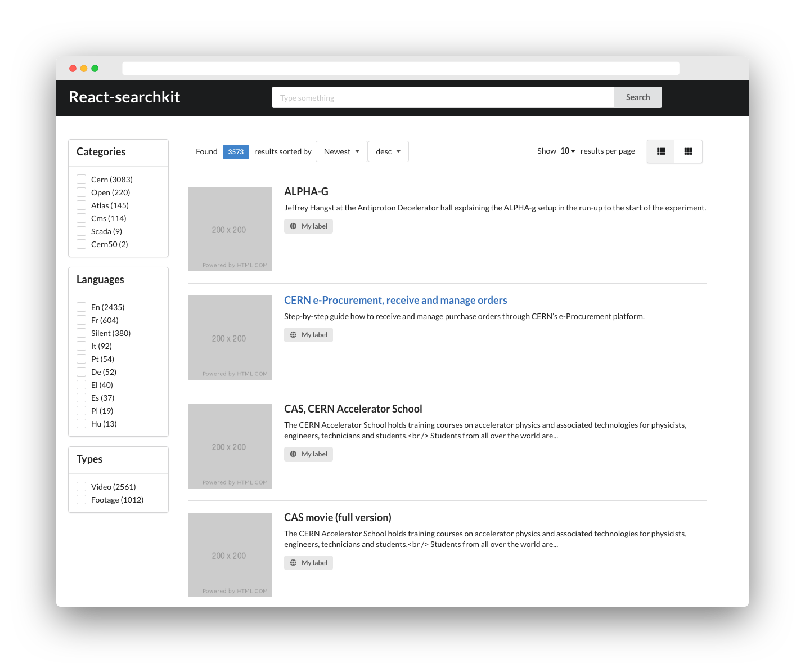

This simple search engine UI extends [React-SearchKit](https://inveniosoftware.github.io/react-searchkit/docs/getting-started) (a free software; which we can redistribute it and/or modify it under the terms of the MIT License)

Main features:

* ready-to-use collection of UI components
* configurable REST API endpoint and serialization
* configurable URL parameters handling



## Developer guide

React-SearchKit uses [create-react-app](https://create-react-app.dev/) as development toolkit.

Install the library:

```
npm install
```

Start the demo application:

```
npm start
```

The library uses [Jest](https://jestjs.io/) as test runner. To run the tests:

```
npm test
```

The library uses `babel` to build a final version inside the `/lib` folder:

```
npm build
```
